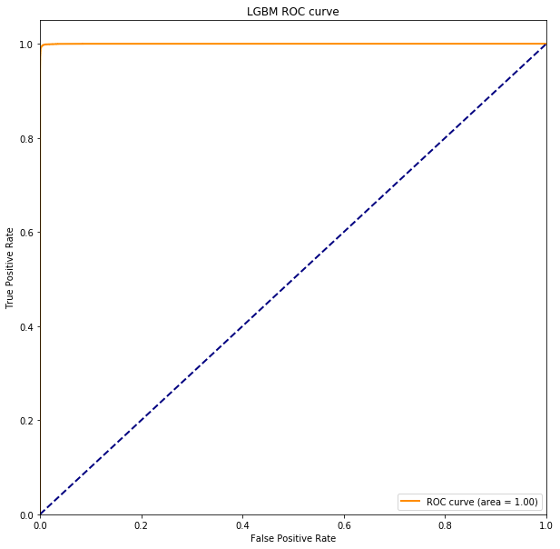

# 常用分类器

分类器+sklearn gridsearch+sklearn ROC curve

效果

# 不均衡样本训练之smote

* 算法原理

smote（Synthetic Minority Oversampling Technique）是机器学习中解决样本不均衡的一个常用方法，其核心思想是通过对小样本点之间进行随机插值，实现小样本增量的同时尽量避免的样本重复带来的过拟合问题。参考[smote 简书](https://www.jianshu.com/p/ecbc924860af)

 |       | andr-intention | andro-action | beauty-action 
 :------: | :------: | :------: | :------: 
 样本均衡性 | 差 | 差 | 差 
 无smote f1-score | 0.6-0.7 | 0.5-0.6 | 0.5-0.6 
 smote f1-score| 0.92 | 0.9111 | 0.9024 

src: Smote.py lightgbm_intention.py

